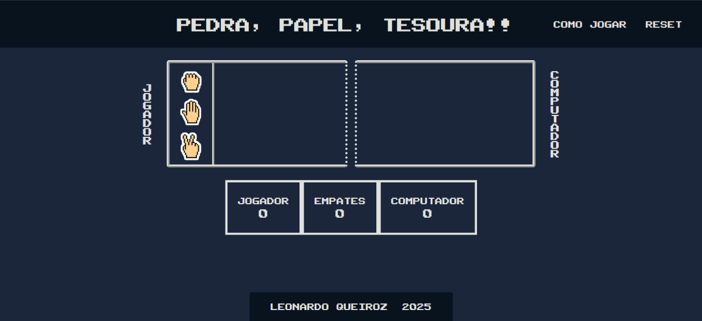

# Pedra, Papel, Tesoura!!

Esta aplicação é um projeto pessoal criado como uma forma de testar e consolidar os conhecimentos de desenvolvimento web adquiridos na primeira etapa do programa [ONE - Oracle Next Education](https://www.oracle.com/br/education/oracle-next-education/). Ela te permite jogar o tradicional jogo de pedra, papel e tesoura contra o computador.

Enquanto escrevia esse projeto, pude praticar lógica de programação e fundamentos de JavaScript. Porém, o desafio maior foi lidar com o CSS, tanto enquanto pensava no design quanto colocava ele em prática. Precisei lidar com paletas de cores, para as quais utilizei o [Coolors](https://coolors.co/) e precisei entender a fundo como o Flexbox do CSS funciona para poder posicionar todos os elementos da forma que eu havia imaginado.

